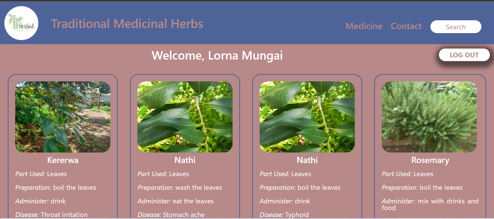

# Traditional Medicinal Herbs System
This Traditional Medicinal Herbs System displays the traditional medicinal herbs collected in the Kihara area, Kiambaa constituency, Kiambu County in Kenya from the Kikuyu Community. 
This study documents the traditional medicinal herbs tacit knowledge into explicit knowledge using this system where this knowledge will be more accessible and available to people in different geographical areas and no language barriers present.
This study will benefit the Kikuyu community and other communities in Kenya as they will have access to available traditional medicinal herbs remedies, which is easier to utilise other than borrowing from other countries.

This system documents:
The image of the traditional medicinal herb.
The local name.
The common name if any.
The part used to treat the disease.
The preparation method.
The administer method.
The disease to be cured.

[Click Here to visit the Traditional Medicinal Herbs System](https://traditional-medicinal-herbs-system-github-io.vercel.app/)

## Author

You can find me on :
[Twitter](https://twitter.com/Lornzyy)
[Github](https://github.com/Lornzyy)

## Learn More
This project was created using the React javascript Library and PostgreSQL for the database

You can learn more in the [Create React App documentation](https://facebook.github.io/create-react-app/docs/getting-started).

To learn React, check out the [React documentation](https://reactjs.org/).

To Learn PostgreSQL, check out [PostgreSQL documentation](https://www.postgresql.org/docs/online-resources/)
